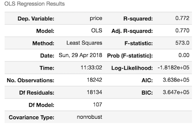
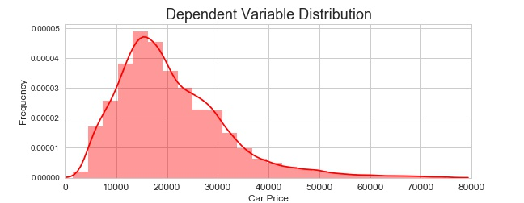
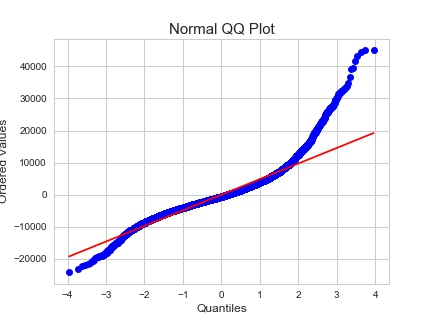
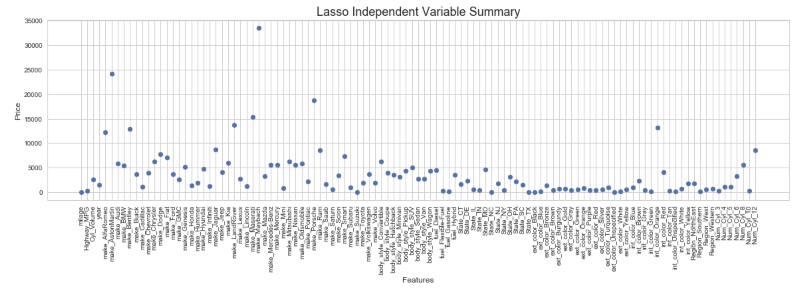
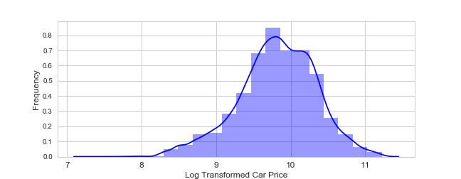
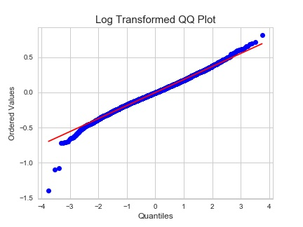
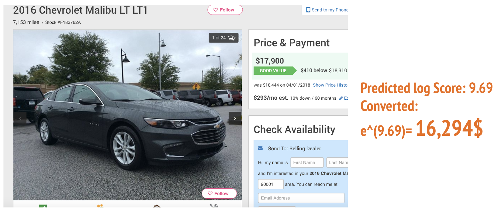

# Used Car Price Prediction Model for Classifieds 

### Table of Contents
[1. Project Overview](#section-a)  
[2. Actions](#section-b)  
[3. EDA](#section-b2)  
[4. Model 1, Linear Regression Model](#section-c).    
[5. Model 2, Linear Regression Lasso Model](#section-c2)   
[6. Model 3, Log Transformed Linear Regression Model](#section-c3)  
[7. Use Case](#section-e)  
[8. Results](#section-end)  
[9. Github Repo - Link](https://github.com/smeetvikani/Used-Car-Price-Predictor-Model)

---

### 1.  Project Overview
##### The goal of this project was to create a Used car price prediction tool for classifieds websites such as Craig’s list. It would assist the seller set a price point using the Logistical Linear Regression model. Setting the right price point which help buyer and seller conclude the sale efficiently. 
---

### 2.  Actions

1. Identified top US cities with most cars per square inch. 

2. For those cities, A total of 26,000 Records were scraped using Beautiful Soup and Selenium over the course of 48 Hours. 

3. Data was acquired from Carfax.com and UsedCars.com

4. Data was then cleaned and validated using Python Pandas library. EDA was performed on this data. 

5. Multiple Linear Regression models were created and tested using pipelines offered by libraries such as Sklearn and StatsModels.  

6. Shared the insights with the client. 

#### Tools Used: Sklearn, StatsModels, Scipy, Patsy Selenium, Beautiful Soup, Python, Pandas, Matplotlib and Seaborn.

---
### 2.  EDA
Exploratory Data Analysis was performed on the data to extract meaningful insights before modeling. 
Below is a violin plot created using Seaborn, represents the histogram of average car spend per state. Only the states listed below were included in the analysis, due to time contraints. 

---
###  Linear Regression

##### Model 1: Summary

First model was created using StatsModels and Patsy Interface. Below is the test data model summary. 

##### Model 1: Residuals
As seen from the residual plot the, model error is not ideal, it varies by upwords of 30k in each direction. I will address this in the next model. 

##### Model 1: Y Factor Distribution
The distribution of the model is right skewed. As a result, increasing the residual error. 

##### Model 1: QQ Plot
The QQ Plot also shows that model is having trouble estimating prices for the most expensive used cars. 

###  Model 2, Linear Regression Lasso Model

Due to high number of features, I had to employ Lasso model to ensure there was no overfitting. Listed below are the features with the highest impact on the model. 
R Squared of this model remained consistant with the performance of pervious model. Thus, there was no overfitting.  

###  Model 3, Log Transformed Linear Regression Model

Depended Variable Log Transformed model was created to deal with the heavy right skewed distribution. Normalizing the distribution would reduce the residual error. 

#### 
Backtransformed Model Score: .84%

##### Model 3: Residual Error
Max Residual Error was upwards of 30k in the previous model, with the log transformed model it was trimmed down to a max of then 10k. 

This model passes the eye test becase, majority of the cars being sold are over 2.5k$

##### Model 3: Y Factor Distribution
The distribution of the model approached the bell curve after the transformation. 

##### Model 3: QQ Plot
There was a huge improvement in the QQ Plot of the log transformed model. It fit the bell curve almost perfectly. 

###  Use Case: 
The model would help estimate following Cars Price before posting to Classifieds or buying from Classifieds.

In a business scenario, the buyer can use this info to bargain a better price point. 

###  Results:

For the obtained dataset, It was assumed that majority of the used cars were under 75,000 USD. 

As a result, Log Transformed Linear Regression Model was accurately able to predict 83% of the variance observed in the dataset. 

###  Contact:
Thank you for visiting the page, feel free to contact me at smeet.vikani@gmail.com
